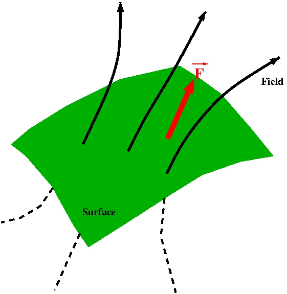
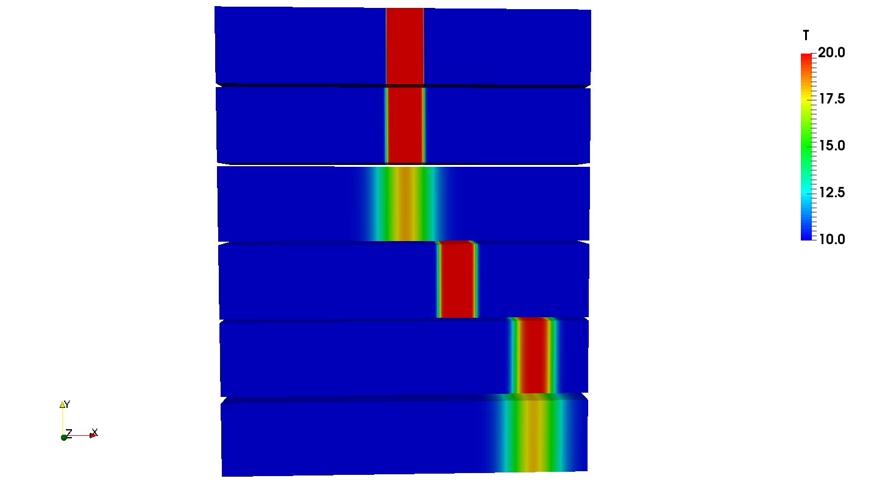
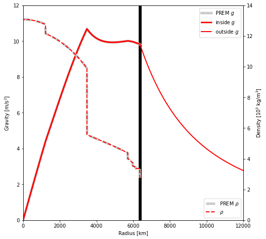
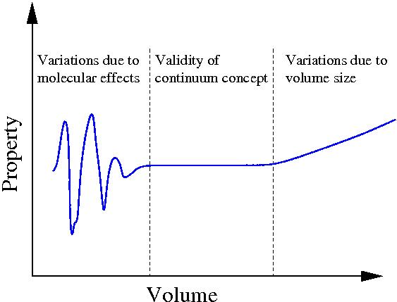
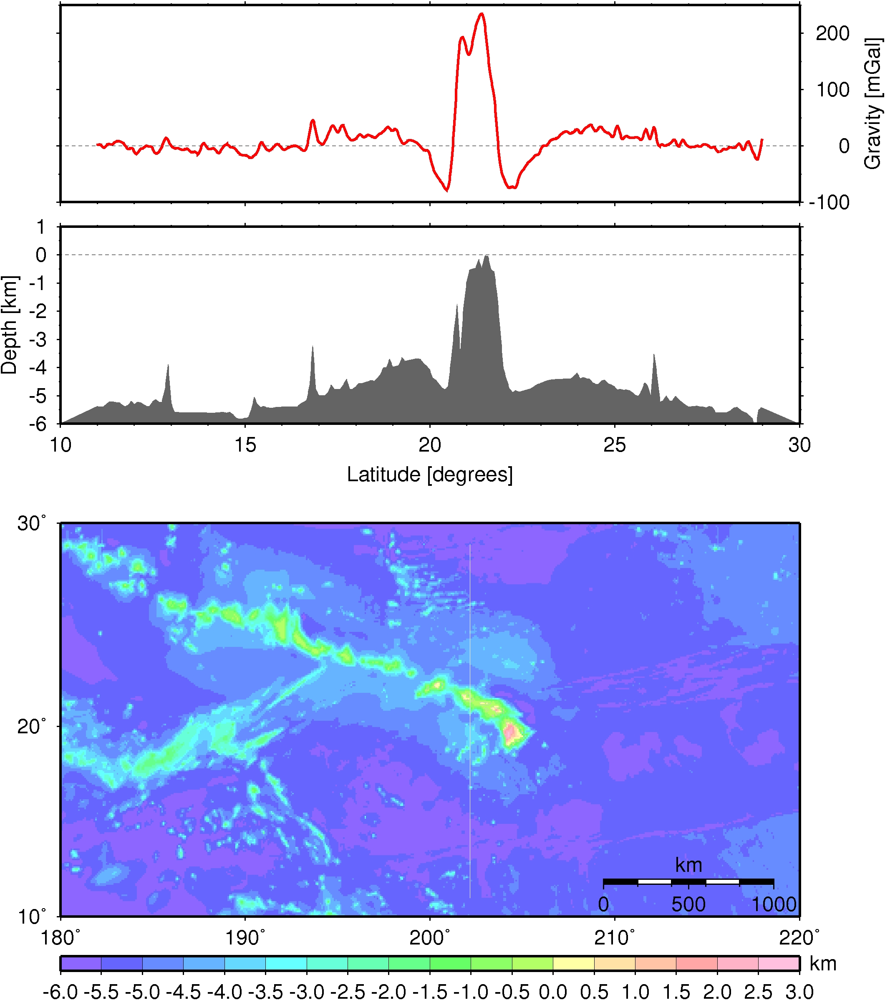

<meta http-equiv="Content-Type" content="text/html; charset=utf-8"/>
<table>
<tr><td></td>
<td bgcolor="#CDCDCD" style="width:600px">
<h1>Dynamical systems in Geosciences</h1>
<h2>Georg Kaufmann</h2>
</td>
</tr>
</table>

Master course tought at [Freie Universität Berlin](http://fu-berlin.de) in the 
**M.Sc. Geological Sciences** program.

## Course summary

This lecture provides an introduction to **dynamical systems** with an emphasis to geosciences. 

We will define several  **mathematical concepts** for physical processes:

- **Flux:**
Movement of a quantity in space and time through a surface (heat, current, water, mass, ...)
- **Continuity:**
Transport of a quantity (mass, energy, momentum, charge, ...) through space and time.
- **Motion:**
Velocity of quantity induced by surface and body forces.
- **Material:**
Behaviour of material to applied forces.

We will complement our mathematical description with examples from the Earth, e.g.
**Heat transport**, **Gravity**, and **Flow in crust and mantle**

## Course instructor

[Georg Kaufmann](http://userpage.fu-berlin.de/~geodyn)<br>
Freie Universität Berlin<br>
Department of Geosciences, Institute of Geological Sciences, Geophysics Section<br>
Malteserstr. 74-100, 12249 Berlin, Haus D, Raum D127<br>
[georg.kaufmann@fu-berlin.de](mailto:georg.kaufmann@fu-berlin.de)

### Course How-To

- You should follow the lectures, preferrably in consecutive order.
- In each lecture, we start with an overview, then as main part the self-learning lecture notes can be downloaded.
- Then, a practical part follows, which is often a link to a python page for simple programming exercises, or some homework.

## Lectures

The lecture series is compiled as handouts in **pdf** format
(click on title):

<table>
<!-- -->
<tr>
<td style="height: 30px;vertical-align:top;text-align:center">
<a href='handouts/Lecture_Dynamics_00_Overview_handout.pdf'>0. Overview</a> <br></td>
<td style="height: 30px;vertical-align:top;text-align:center">
<a href='handouts/Lecture_Dynamics_01_Introduction_handout.pdf'>1. Introduction</a> <br></td>
<td style="height: 30px;vertical-align:top;text-align:center">
<a href='handouts/Lecture_Dynamics_02_Flux_handout.pdf'>2. Flux</a> <br></td>
</tr>
<!-- -->
<tr>
<td style="height: 30px;vertical-align:top;text-align:center">
<a href='handouts/Lecture_Dynamics_03_Continuity_handout.pdf'>3. Continuity</a> <br></td>
<td style="height: 30px;vertical-align:top;text-align:center">
<a href='handouts/Lecture_Dynamics_04_Heat_handout.pdf'>4. Heat</a> <br></td>
<td style="height: 30px;vertical-align:top;text-align:center">
<a href='handouts/Lecture_Dynamics_05_Gravity_handout.pdf'>5. Gravity</a> <br></td>
</tr>
<!-- -->
<tr>
<td style="height: 30px;vertical-align:top;text-align:center">
<a href='handouts/Lecture_Dynamics_06_Motion_handout.pdf'>6. Motion</a> <br></td>
<td style="height: 30px;vertical-align:top;text-align:center">
<a href='handouts/Lecture_Dynamics_07_Material_handout.pdf'>7. Material</a> <br></td>
<td style="height: 30px;vertical-align:top;text-align:center">
<a href='handouts/Lecture_Dynamics_08_Elastic_handout.pdf'>8. Elastic</a> <br></td>
</tr>
<!-- -->
<tr>
<td style="height: 30px;vertical-align:top;text-align:center">
<a href='handouts/Lecture_Dynamics_09_Viscous_handout.pdf'>9. Viscous</a> <br></td>
<td style="height: 30px;vertical-align:top;text-align:center">
<a href='handouts/Lecture_Dynamics_10_Viscoelastic_handout.pdf'>10. Viscoelastic</a> <br></td>
<td style="height: 30px;vertical-align:top;text-align:center">
<a href='handouts/Lecture_Dynamics_11_Reactions_handout.pdf'>11. Reactions</a> <br></td>
</tr>
<!-- -->
</table>

## Exercises

The exercises are mainly **jupyter** notebooks, which can be accessed interactively through<br>
[](https://mybinder.org/v2/gh/georgkaufmann/lecture_dynamics.git/main?filepath=index.ipynb)

[](https://mybinder.org/v2/gh/georgkaufmann/jupyter/main?urlpath=git-pull?repo=https://github.com/georgkaufmann/lecture_dynamics)

A list of notebooks can be found here:

- <a href="README_Notebooks.md" target="_blank">List of Juypter notebooks</a>

## Download
```
git clone https://github.com/georgkaufmann/lecture_dynamics.git
```

## Versioning

We use [Git](https://git-scm.com/) for versioning.

## Authors

* **Georg Kaufmann** - *Initial work* - [Georg Kaufmann](http://userpage.fu-berlin.de/~geodyn)


## License

This project is licensed for classroom use only.

## Acknowledgments
