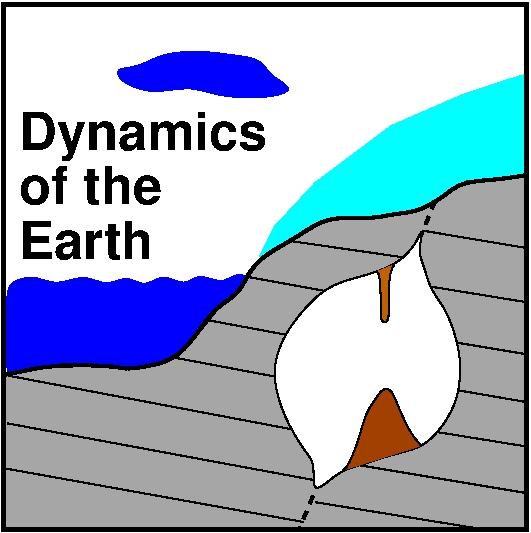

<table>
<tr><td></td>
<td bgcolor="#FFFFFF">
    
AG Dynamics of the Earth

    
Jupyter notebooks

    
Georg Kaufmann

    </td>
</tr>
</table>

# Dynamic systems in Geosciences
----
*Georg Kaufmann,
Geophysics Section,
Institute of Geological Sciences,
Freie Universität Berlin,
Germany*

**Additional jupyter notebooks for lecture**

Lectures:

- Lecture 1: **Introduction**
    - [Coding](Dynamics_lab01_intro.ipynb)
    - [Basic equations](Dynamics_lab01_BasicEquations.ipynb)
    - [openFOAM](Dynamics_lab01_openFoam.ipynb)
    - [ParaView](Dynamics_lab01_ParaView.ipynb)
   
- Lecture 2: **Flux**
    - [Flux equations](Dynamics_lab02_flux.ipynb)
    - [Blautopf: data](Dynamics_lab02_Blautopf_data.ipynb)
    - [Blautopf: simple tank](Dynamics_lab02_SimpleTank.ipynb)
    - [Blautopf: Bernoulli equation](Dynamics_lab02_Bernoulli.ipynb)
    - [Blautopf: model](Dynamics_lab02_Blautopf_model.ipynb)
    
- Lecture 3: **Continuity**
    - [Continuity equation](Dynamics_lab03_continuity.ipynb)
    - [1D advection](Dynamics_lab03_advection1D.ipynb)
    - [1D diffusion](Dynamics_lab03_diffusion1D.ipynb)
    - [1D reaction](Dynamics_lab03_reaction1D.ipynb)
    - [openFOAM: laplacianFoam (heat diffusion)](Dynamics_lab03_HeatDiffusion_laplacianFoam1.ipynb)
    - [openFOAM: scalarTransportFoam (heat transport)](Dynamics_lab03_HeatTransport_scalarTransportFoam.ipynb)
    - [openFOAM: example 2D heat blob]
    
- Lecture 4: **Heat**
    - [Radial profiles](Dynamics_lab04_RadialProfiles.ipynb)
    - [Seasons](Dynamics_lab04_Seasons.ipynb)

- Lecture 5: **Gravity**
    - [Radial gravity profile](Dynamics_lab05_RadialGravity.ipynb)
    - [Normal gravity](Dynamics_lab05_theoretical_g.ipynb)
    - [Spherical harmonics](Dynamics_lab05_Ynm.ipynb)
    - [Gravity field from Stokes coefficients](Dynamics_lab05_Ynm_examples.ipynb)

- Lecture 6: **Motion**
    - [Equation of motion]
    
- Lecture 7: **Material**
    - [Elastic]
    - [Viscous]
    - [Viscoelastic]

- Lecture 8: **Elastic material**
    - [Elastic]
    - [openFOAM: solidDisplacementFoam (plate with hole)](Dynamics_lab07_HoleInPlate_solidDisplacementFoam.ipynb)

- Lecture 9: **Viscous material**
    - [Navier-Stokes equation](Dynamics_lab09_NavierStokes.ipynb)
    - [Hagen-Poiseuille](Dynamics_lab09_HagenPoiseuille.ipynb)
    - [openFOAM: icoFoam (Hagen-Poiseuille)](Dynamics_lab09_HagenPoiseuille_icoFoam.ipynb)
    - [openFOAM: simpleFoam (Hagen-Poiseuille)](Dynamics_lab09_HagenPoiseuille_simpleFoam.ipynb)
    - [openFOAM: icoScalarTransportFoam (Hagen-Poiseuille)](Dynamics_lab09_HagenPoiseuille_icoScalarTransportFoam.ipynb)
    - [Mantle convection]
    - [openFOAM: convectiveFoam]
    
- Lecture 10: **Viscoelastic material**
    - [Heaviside loading]

- Lecture 11: **Reactions**
    - [Diffusion and advection](Dynamics_lab11_Diffusion_Advection.ipynb)
    - [One reactant](Dynamics_lab11_One_Reactant.ipynb)
    - [Two reactants](Dynamics_lab11_Two_Reactants.ipynb)
    - [Three reactants](Dynamics_lab11_Three_Reactants.ipynb)
    
- Lecture 12: **Shallow water**
    - [Shallow-water equations](Dynamics_lab12_SWE.ipynb)
    - [openFOAM: shallowWaterFoam (Dam break)](Dynamics_lab12_DamBreak_shallowWaterFoam.ipynb)
    - [Analytical examples for dam break](Dynamics_lab12_DamBreak.ipynb)
    - [1D advection revisited](Dynamics_lab12_advection1D_FiniteVolume_LLF.ipynb)
    - [1D Numerical solution SWE](Dynamics_lab12_SWE1DwithLocalLaxFriedrich.ipynb)
    - [2D advection revisited](Dynamics_lab12_advection2D_FiniteVolume_LLF.ipynb)
    - [2D Numerical solution SWE](Dynamics_lab12_SWE2DwithLocalLaxFriedrich.ipynb)

----
